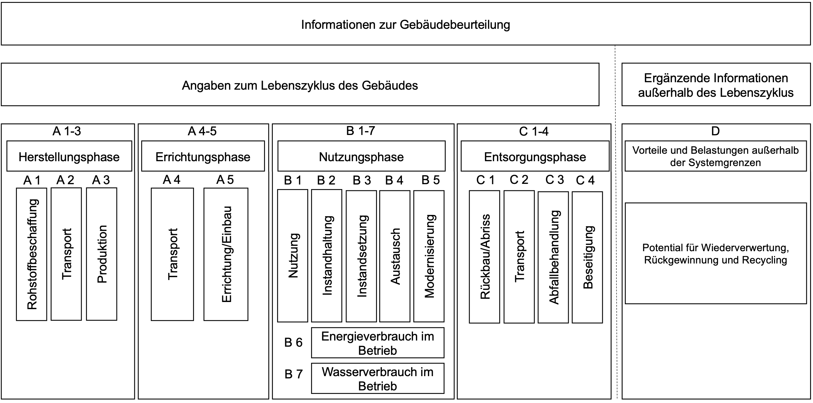

.. index:: LCA, TGA

###############################################################################
Gebäude-Lebenszyklusanalyse
###############################################################################

Anhand von Lebenszyklusanalysen auf Gebäudeebene lassen sich unter anderem die
ökologischen, ökonomischen und sozialen Auswirkungen von Gebäuden, bzw. deren
stofflicher und energetischer Ressourcenbedarf, auf unsere Umwelt (inkl. Menschen),
über deren gesamten Lebenszyklus erfassen, analysieren, bewerten und optimieren.

Eine ökologische Lebenszyklusanalyse wird im Deutschen "Ökobilanz" gennant. Werden die ökonomischen
Aspekte im Rahmen einer Lebenszyklusanalyse betrachtet, dann spricht man von
einer Lebenszykluskostenanalyse (engl. Life Cycle Cost Assessment). Die soziale Lebenszyklusanalyse
wird im Englischen als "Social Life Cycle Assessment" bezeichnet.

Bei einer gebäudebezogenen Lebenszyklusanalyse, die als Analyse- bzw. Untersuchungsziel
das Thema der Klimaneutralität definiert, liegt der Fokus somit auf der Durchführung von
Ökobilanzen.

*******************************************************************************
Ökobilanzen von Gebäuden
*******************************************************************************

Die folgenden Inhalte aus diesem Grundlagenkapitel stammen aus der WECOBIS online-Publikation
`"Zwischen den Zeilen von Ökobilanzen" <https://www.wecobis.de/service/sonderthemen-info/gesam
ttext-oekobilanz-zwischen-den-zeilen-info.html>`_
von Patricia Schneider-Marin, Hannes Harter und Michael Vollmer.

Ökobilanzen dienen grundsätzlich der Quantifizierung des Ressourceneinsatzes und
der Umweltwirkungen von Produkten oder Dienstleistungen über deren Lebenszyklus.
Werden Ökobilanzen berechnet, heißt das nicht zwangsläufig, dass das Objekt der
Ökobilanz nachhaltig ist. Es bedeutet lediglich, dass die Umweltauswirkungen eines
Produkts oder einer Dienstleistung über deren Lebenszyklus hinweg ermittelt und
berechnet wurden. Die Ergebnisse einer Ökobilanz dienen dann als Grundlage für einen
Vergleich von Produkten oder Dienstleistungen. Erst der direkte Vergleich ermöglicht
es, eine Aussage darüber zu treffen, welches Produkt z.B. weniger Treibhausgase
emittiert. Dabei ist zu beachten, dass Ökobilanzen an sich kein Zertifikat darstellen,
jedoch Teil einer Gebäude-Zertifizierung sein können. Für Gebäude gibt es Ökobilanzen
auf verschiedenen Ebenen, z.B. für

* einzelne Bauprodukte (z.B. ein Dämmstoff),
* Bauteile (z.B. ein Wärmedämmverbundsystem oder eine Vorhangfassade),
* Prozesse (z.B. Energieerzeugung) oder
* ganze Gebäude.

Ziel einer Ökobilanz
===============================================================================

Bevor eine Ökobilanz gerechnet wird, muss zunächst das Ziel definiert werden.
Wichtig ist, dass eine klare Fragestellung vorhanden ist, auf die die Untersuchung
abgestimmt wird. Beispiele für solche Fragestellungen wären: "Welcher Dämmstoff
emittiert im Laufe seines Lebenszyklus am wenigsten Treibhausgas (THG)-Emissionen?"
"Welche Fassadenart benötigt für ihre Herstellung am wenigsten nicht-erneuerbare
Primärenergie?" "Welcher Energiestandard erlaubt bei diesem Gebäude eine
lebenszyklusbezogene THG-Neutralität?" Fragen wie: "Ist dieses Produkt umweltfreundlicher
als ein anderes?" "Holz oder Beton?" - sind zu wenig präzise, um sie mit einer
Ökobilanz beantworten zu können, weil sich umgehend weiterführende Fragestellungen
ergeben wie beispielsweise: Unter welchen zeitlichen und räumlichen Umständen
(Systemgrenzen, Rahmenbedingungen)? Wo und wie werden die Produkte verwendet
(Lebensdauer, Funktion)? Welche Datengrundlagen stehen für die Bilanzierung zur Verfügung?

Funktionelle Einheit
===============================================================================

Die funktionelle Einheit beschreibt die zentrale Bezugsgröße, auf die sich die Ökobilanz
bezieht, also zum Beispiel, 1 m\ :sup:`3`\ Baumaterial, 1 m\ :sup:`2`\ beheizte Wohnfläche,
1 Gebäudenutzer, 1 Bürogebäude etc. Die errechneten Ergebnisse der Ökobilanz beziehen sich
auf diese Einheit.

Systemgrenzen
===============================================================================

Die Systemgrenze definiert sowohl den zeitlichen Betrachtungshorizont (z.B. Lebensdauer
des Gebäudes, inkludierte Lebenszyklusphasen) als auch den räumlich-technischen
(z.B. welche Materialien und Bauteile bilanziert werden, welche nicht).

Lebenszyklusphasen
===============================================================================

Die Lebenszyklusphasen (siehe folgende Abbildung) unterteilen die komplette Lebensdauer des Gebäudes
in einzelne Phasen, auch Module genannt. Die erste Phase stellt die Herstellungsphase (A1-A3) dar.
Diese Phase bezieht sich auf die Herstellung des Produkts inklusive des notwendigen Rohstoffabbaus.
Darauf folgt die Errichtungsphase (A4-A5), wobei Baustellenprozesse z.B. zur Errichtung des Gebäudes
aufgeführt werden. In der Nutzungsphase (B1-B7) werden der Energiebedarf für das Gebäude und/oder der
Austausch von Materialien und Bauteilen bilanziert. Nach der Nutzungsphase folgt die Entsorgungsphase
(C1-C4). In dieser Phase werden alle Prozesse und Wirkungen bilanziert, die mit dem Rückbau des Gebäudes
und der Entsorgung und Aufbereitung von Materialien zu tun haben. Daraus entstehende Potentiale wie z.B.
Recyclingpotentiale werden in der letzten Phase (Modul D) aufgeführt.

Datenbanken
===============================================================================

Grundlagen für Gebäude-Ökobilanzen liefern Datenbanken, in denen Daten für ganze Produkte zusammengestellt
sind, da eine individuelle Bilanzierung aller Prozesse, die für ein Gebäude notwendig sind, viel zu aufwendig
wäre. Außerdem würden die Komplexität und die Vielzahl der Annahmen, die getroffen werden müssten, dazu führen,
dass Ergebnisse kaum noch vergleichbar sind. Meistverwendet in Deutschland ist die
`ÖKOBAUDAT <https://www.oekobaudat.de/>`_.
Solche Datensätze sind Momentaufnahmen, die den Durchschnitt von produkt- und dienstleistungsbezogenen Produktions-,
Nutzungs- und Entsorgungsprozessen abbilden. Diese können aufgrund technischer und politischer Änderungen dynamischen
Schwankungen unterliegen, die in den Datensätzen nicht abgebildet werden. Außerdem gibt es grundsätzlich verschiedene
Arten von Datensätzen, wie beispielweise Durchschnittsdatensätze (z.B. Mittelwert für ein Produkt in Deutschland)
und spezifische Datensätze (z.B. für ein Material eines bestimmten Herstellers).

Ergebnisdarstellung
===============================================================================

Die Ergebnisse von Ökobilanzen gliedern sich in viele Kategorien: Hier gibt es zunächst die "Inputs", d.h. Materialien
und Energie, wie zum Beispiel der nicht erneuerbare Primärenergiebedarf (:term:`PENRT`) in MJ. Oft wird diese Kategorie dargestellt,
wenn es um den Ressourceneinsatz geht. Zweite wichtige Säule sind die Umweltwirkungen. In der aktuellen Diskussion ist hier
in den meisten Fällen vom globalen Erwärmungspotential (global warming potential = :term:`GWP`), gemessen in THG Äquivalenten, die Rede.
Output-Kategorien (z.B. radioaktiver Abfall) kommen in Ergebnisdarstellungen selten vor.

*******************************************************************************
Lebenszyklusanalysen bzw. Ökobilanzen großer Gebäudebestände
*******************************************************************************

Mit Hilfe der Nutzung von 3D-Stadtmodellen hat Herr Hannes Harter im Rahmen seiner Dissertation
mit dem Titel "Lebenszyklusanalyse der Technischen Gebäudeausrüstung großer Wohngebäudebestände
auf der Basis semantischer 3D-Stadtmodelle" eine Methode bzw. einen generischen Ansatz zur
Berechnung der lebenszyklusbasierten energetischen, emissions- und kostenbezogenen Bilanz von Gebäuden
und deren Technischer Gebäudeausrüstung (TGA) entwickelt. Der generische Ansatz ermöglicht, dass die Methode
auf beliebig große Gebäudebestände (einzelne Gebäude, Stadtquartiere, Städte usw.) angewendet werden kann.

Die entwickelte Methode wurde programmierseitig umgesetzt (Java) und mündet in einem Softwaretool, das
ermöglicht, die Methode iterativ auf eine beliebig große Anzahl von Gebäuden anzuwenden. Zudem
erlaubt das Tool die Durchführung und Berechnung verschiedener Entwicklungsszenarien bspw. mit dem Ziel
der Klimaneutralität. Das Softwaretool wird **urbi+** genannt, das als Abkürzung für "urban
improvement" steht. Das ``+`` signalisiert den offenen Ansatz, der bei der Entwicklung verfolgt wurde.
Dieser Ansatz ermöglicht es, weitere Bewertungs- und Analysehorizonte in fortführenden Arbeiten in
urbi+ zu integrieren. Dabei ist z. B. die Erweiterung auf Nichtwohngebäude und den Kühlenergiebedarf geplant.
Es ist geplant, dass urbi+ bei der `v3sta UG <https://www.v3sta.de/>`_ für Untersuchungen im Rahmen
der `kommunalen Wärmeplanung <https://um.baden-wuerttemberg.de/de/service/publikation
/did/handlungsleitfaden-kommunale-waermeplanung/>`_
von Kommunen in Baden-Württemberg zum Einsatz kommt.

Beispielhafte wissenschafliche Ergebnisse inkl. deren Visualisierung können unter der
`Verlinkung auf GitHub <https://github.com/tum-gis/LCA-TGA>`_ eingesehen werden.
