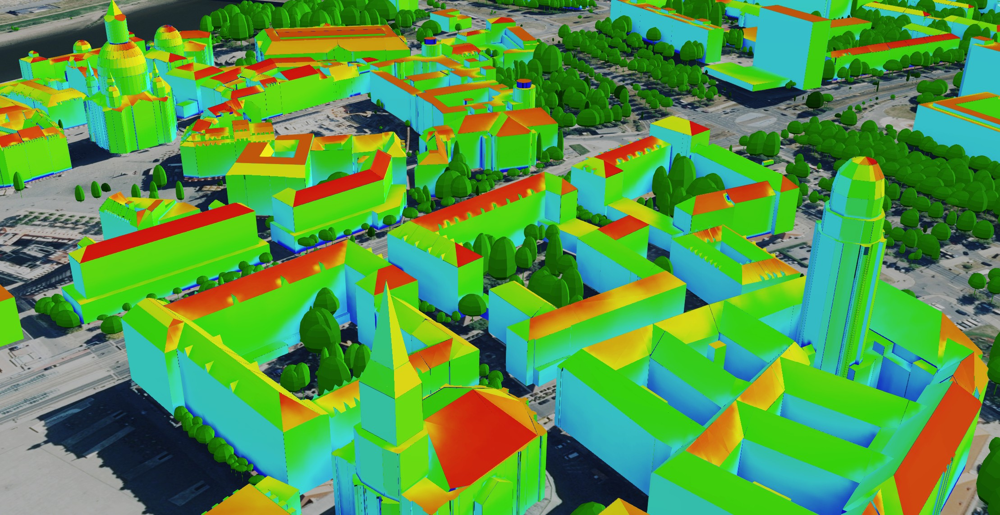

.. index:: Solarpotentialanalyse

###############################################################################
Solarpotentialanalyse mit semantischen 3D-Stadtmodellen
###############################################################################

Features
===============================================================================

* Solarpotentialanalyse auf Basis von semantischen 3D-Stadtmodellen in der Cloud
* Hohe Skalierbarkeit zur Berechnung von ganzen Städten und multiplen
  "Was wäre wenn?"-Szenarien
* Kalibrierung mit NASA-Daten zur Abbildung lokaler klimatischer Bedingungen

* Detaillierte Infos in den `Publikationen <https://www.asg.ed.tum.de/gis/unser-team/leh
  rstuhlangehoerige/bruno-willenborg/#c639>`_

  3D-Web-Map-Client Dresden

*******************************************************************************
Online Demos
*******************************************************************************

3D-Web-Map-Client München
===============================================================================

Die Webclient Demo zeigt vier Berechnungsszenarien für ganz München aus einer
wissenschaftlichen Untersuchung zum Einfluss der Vegetation und verschiedener
LoDs von Stadtmodellen auf die Ergebnisse der Solarpotentialanalyse.

.. rubric:: Berechnungsszenarien:

* LoD1 mit Vegetation
* LoD1 ohne Vegetation
* LoD2 mit Vegetation
* LoD2 ohne Vegetation

Hier geht's zur Demo: |:rocket:|  `Webclient Link <https://www.3dcitydb.org/3dcitydb/fileadmin/public/3dcitydb-web-map/3dwebclient/
?t=3DCityDB-Web-Map-Client&s=false&ts=0&la=48.146479&lo=11.568271&h=659.643&hd=343.25&p=-30
.38&r=359.94&l_0=u%3Dhttps%253A%252F%252Fwww.3dcitydb.org%252F3dcitydb%252Ffileadmin%2
52Fpublic%252F3dwebclientprojects%252FmunichSolarFull%252Fvegetation%252Fmunich_vegetati
on_collada_MasterJSON.json%26n%3DVegetation%26ld%3DCOLLADA%252FKML%252FglTF%26lp%3Dfalse%26lc%
3Dtrue%26gv%3D2.0%26a%3Dtrue%26tdu%3D%26ds%3DGoogleSheets%26tt%3DHorizontal%26gc%3D%26il%3D120%26al
%3D1.7976931348623157e%252B308%26ac%3D100%26av%3D50&l_1=u%3Dhttps%253A%252F%252Fwww.3dcitydb.org%
252F3dcitydb%252Ffileadmin%252Fpublic%252F3dwebclientprojects%252FmunichSolarScenarios%252Flod1_dgm
%252Fsolar-bldg-glTF%252Flod1_orgBy_dgm_solar-bldg-glTF_collada_MasterJSON.json%26n%3DBldg%2520L
oD1%2520-%2520Terrain%26ld%3DCOLLADA%252FKML%252FglTF%26lp%3Dfalse%26lc%3Dtrue%26gv%3D2.0%26a%3Df
alse%26tdu%3Dhttps%253A%252F%252Fbsvr.gis.lrg.tum.de%252Fpostgrest%252Fmunich_lod1_dgm%26ds%3DPostgr
eSQL%26tt%3DVertical%26gc%3D%26il%3D120%26al%3D1.7976931348623157e%252B308%26ac%3D100%26av%3D50&l_2=u
%3Dhttps%253A%252F%252Fwww.3dcitydb.org%252F3dcitydb%252Ffileadmin%252Fpublic%252F3dwebclientproj
ects%252FmunichSolarScenarios%252Flod1_dgm_vegetation%252Fsolar-bldg-glTF%252Flod1_orgBy_dgm_veget
ation_solar-bldg-glTF_collada_MasterJSON.json%26n%3DBldg%2520LoD1%2520-%2520Terrain%252C%2520Vege
tation%26ld%3DCOLLADA%252FKML%252FglTF%26lp%3Dfalse%26lc%3Dtrue%26gv%3D2.0%26a%3Dfalse%26tdu%3Dht
tps%253A%252F%252Fbsvr.gis.lrg.tum.de%252Fpostgrest%252Fmunich_lod1_dgm_vegetation%26ds%3DPostgre
SQL%26tt%3DVertical%26gc%3D%26il%3D120%26al%3D1.7976931348623157e%252B308%26ac%3D100%26av%3D50&l_
3=u%3Dhttps%253A%252F%252Fwww.3dcitydb.org%252F3dcitydb%252Ffileadmin%252Fpublic%252F3dwebclientp
rojects%252FmunichSolarScenarios%252Flod2_dgm%252Fsolar-bldg-glTF%252Flod2_dgm_solar-bldg-glTF_co
llada_MasterJSON.json%26n%3DBldg%2520LoD2%2520-%2520Terrain%26ld%3DCOLLADA%252FKML%252FglTF%26lp
%3Dfalse%26lc%3Dtrue%26gv%3D2.0%26a%3Dfalse%26tdu%3Dhttps%253A%252F%252Fbsvr.gis.lrg.tum.de%252F
postgrest%252Fmunich_lod2_dgm%26ds%3DPostgreSQL%26tt%3DVertical%26gc%3D%26il%3D120%26al%3D1.7976
931348623157e%252B308%26ac%3D100%26av%3D50&l_4=u%3Dhttps%253A%252F%252Fwww.3dcitydb.org%252F3dci
tydb%252Ffileadmin%252Fpublic%252F3dwebclientprojects%252FmunichSolarFull%252Fsolar-bldg-glTF%25
2Fmunich_solar-bldg-glTF_collada_MasterJSON.json%26n%3DBldg%2520LoD2%2520-%2520Terrain%252C%2520
Vegetation%26ld%3DCOLLADA%252FKML%252FglTF%26lp%3Dfalse%26lc%3Dtrue%26gv%3D2.0%26a%3Dtrue%26tdu%
3Dhttps%253A%252F%252Fbsvr.gis.lrg.tum.de%252Fpostgrest%252Fmunich_full%26ds%3DPostgreSQL%26tt%3
DVertical%26gc%3D%26il%3D120%26al%3D1.7976931348623157e%252B308%26ac%3D100%26av%3D50&tr=name%3DD
GM1%26iconUrl%3Dhttps%253A%252F%252Fwww.3dcitydb.org%252F3dcitydb%252Ffileadmin%252Fpublic%252F3
dwebclientprojects%252Fdgm.png%26tooltip%3DLDBV%2520-%2520DGM1%26url%3Dhttps%253A%252F%252Fwww.3
dcitydb.org%252F3dcitydb%252Ffileadmin%252Fpublic%252F3dwebclientprojects%252Fterrain_bay_geomas
sendaten&sw=>`_ |:rocket:|

.. note:: Der Webclient hat die beste Performance mit GoogleChome und profitiert von einer
  starken Grafikkarte.
