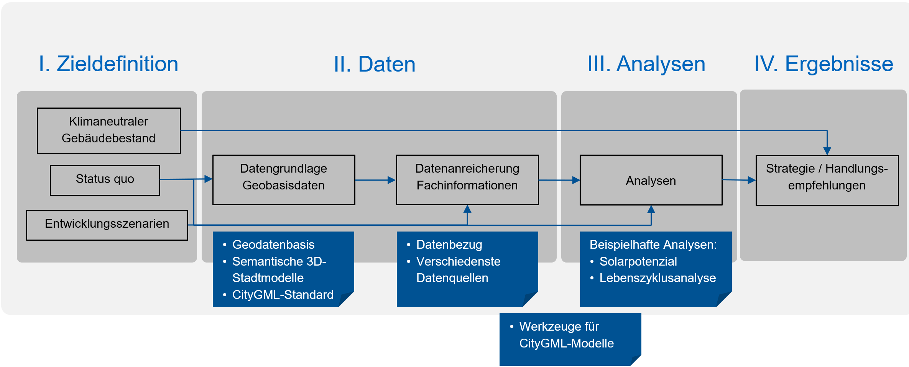

###############################################################################
DGNB Seminar - Klimaneutraler Gebäudebestand mit 3D-Stadtmodellen
###############################################################################

.. rubric:: Klimaneutrale Quartiere: richtige Entscheidungen treffen mit
  Geoinformationen und 3D-Stadtmodellen

  Übersicht zu Daten, Werkzeugen und Datenströmen auf dem Weg der Geodaten hin zum
  klimaneutralen Gebäudebestand.

.. toctree::
  :maxdepth: 3
  :caption: Inhalt

  semantic-3d-models/semantic-3d-models
  citygml/data-availability
  tools/tools
  apps/apps
  glossary/glossary
  literature
  contact
  demo/demo

* :ref:`genindex`
