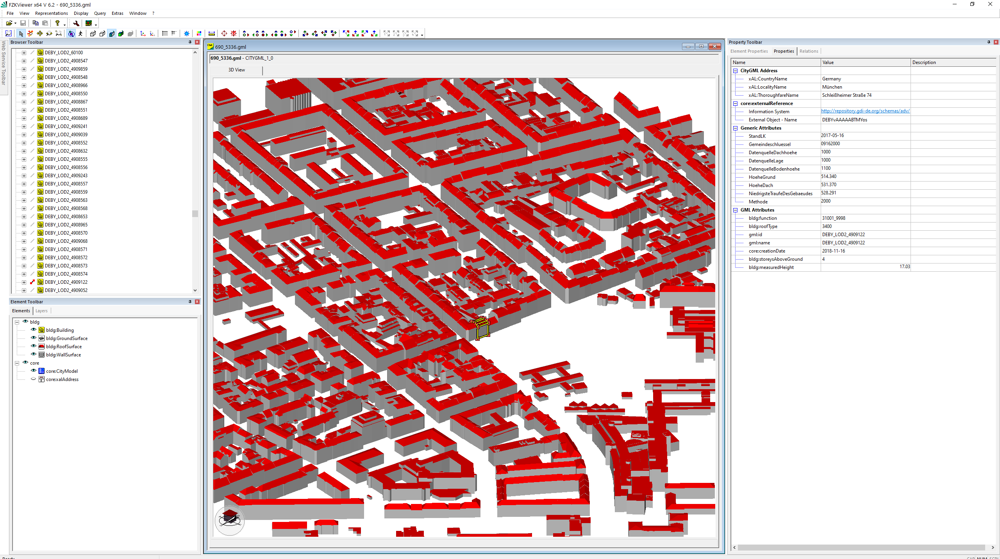
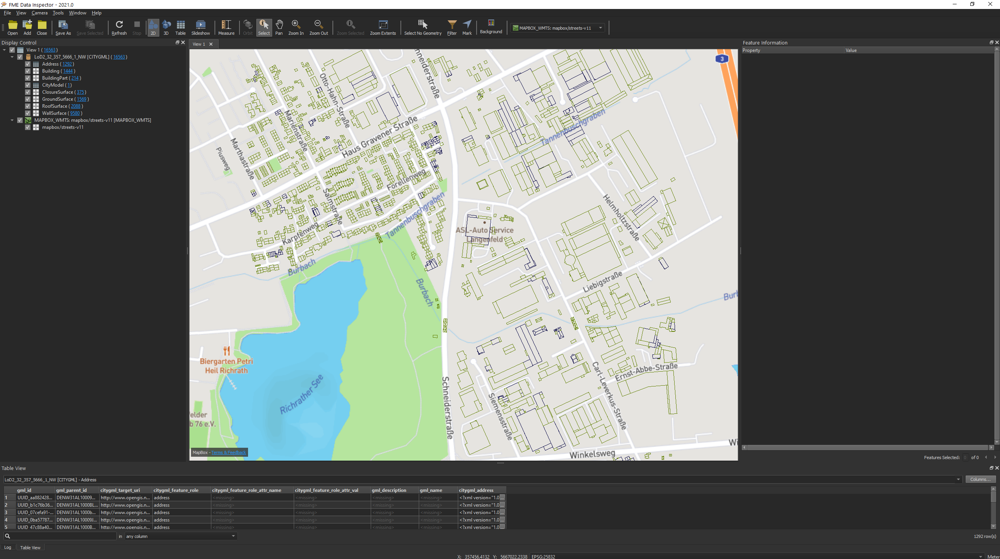
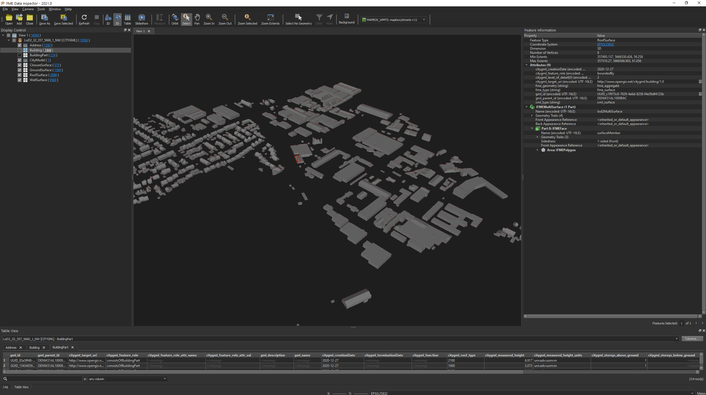
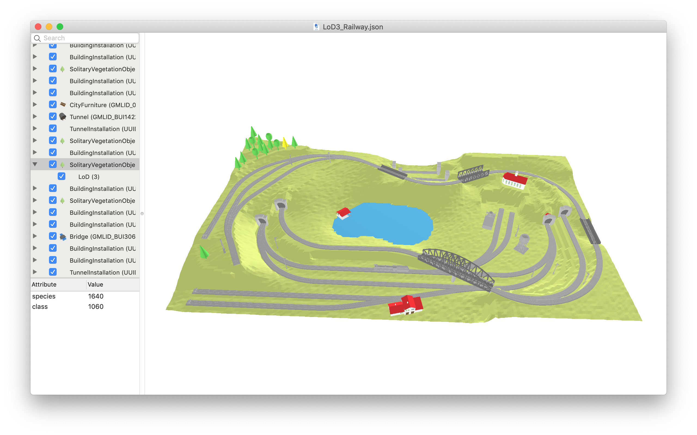
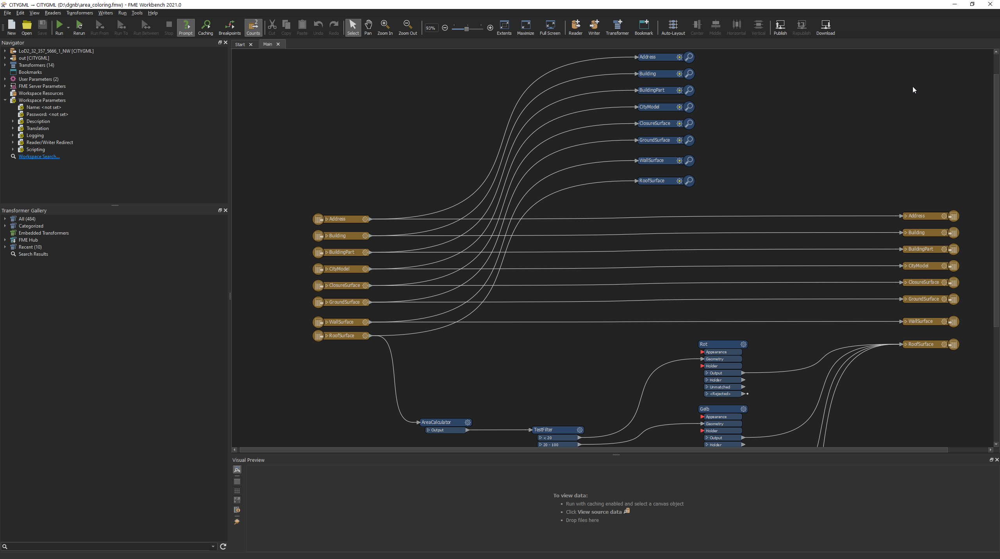

.. index:: CityGML Werkzeuge

###############################################################################
Werkzeuge für CityGML
###############################################################################

.. index:: Datenauswahl

*******************************************************************************
Datenauswahl und Übersicht
*******************************************************************************

Vor der Auswahl von Daten lohnt sich ein Blick auf die Übersicht zu den amtlichen
:ref:`Koordinatensystemen <citygml/data-availability:Koordinatensysteme in Deutschland>`
in Deutschland.

Falls die Daten ETRS89 vorliegen, kann man mit dieser Grafik die UTM-Zone der Daten
abschätzen:

.. figure:: https://www.ldbv.bayern.de/file/png/10317/o/UTM_Zonen.png
  :width: 50 %
  :target: https://www.ldbv.bayern.de/file/png/10317/o/UTM_Zonen.png
  :align: center

  Übersicht UTM-Zonen in Deutschland |copy| `LDBV <https://www.ldbv.bayern.de/>`_

https://www.koordinaten-umrechner.de
  Website, auf der sich eine Position in verschiedenen Koordinatensystemen
  anzeigen bzw. Umrechnen lässt. In Deutschland liegen die meisten Daten im
  amtlichen Koordinatensystem ETRS89, UTM-Zone 32N oder 33N vor.

.. index:: 3D City Database, 3DCityDB, WFS, Web Feature Service, Importer/Exporter

*******************************************************************************
3D City Database Suite
*******************************************************************************

Sammlung an Open Source Softwarewerkzeugen für den CityGML-Standard.
Die 3D City Database umfasst die folgenden Werkzeuge:

* `3DCityDB <https://3dcitydb-docs.readthedocs.io/en/latest/3dcitydb/index.html>`_:
  Datenhaltung und Analyse mit relationalen Datenbanken.
* `Importer/Exporter <https://3dcitydb-docs.readthedocs.io/en/latest/impexp/index.html>`_:
  Daten Importer/Export für die 3DCityDB. Export von Visualisierungsformaten für den
  3D-Web-Map-Client. Der Importer/Exporter unterstützt zahlreiche
  `Erweiterungen <https://3dcitydb-docs.readthedocs.io/en/latest/plugins/index.html>`_,
  z.B. für den Export von tabellarischen Daten.
* `3D-Web-Map-Client <https://3dcitydb-docs.readthedocs.io/en/latest/webmap/index.html>`_:
  `Cesium <https://cesium.com/>`_ basierter 3D-Web-Map-Client zur Visualisierung und
  Analyse von 3D-Stadtmodellen im Browser.
* `Web Feature Service <https://3dcitydb-docs.readthedocs.io/en/latest/wfs/index.html>`_:
  OGC-konformer Web Feature Service zur Abfrage von 3D-Stadtmodelldaten über eine
  Web-Schnittstelle.

.. rubric:: Weitere Links

* `3DCityDB offizielle Homepage <https://www.3dcitydb.org/3dcitydb/>`_
* `3DCityDB Github <https://github.com/3dcitydb>`_
* `3DCityDB Online Dokumentation <https://3dcitydb-docs.readthedocs.io/en/latest/>`_

.. index:: Docker

3DCityDB Docker
===============================================================================

Alle 3D City Database Werkzeuge stehen als Docker images zur Verfügung.
Eine Einführung in die Images gibt es `hier <https://3dcitydb-docs.readthedocs.io/en
/latest/first-steps/docker.html>`_. Der Einstieg in die 3DCityDB wird mit den
Images wesentlich erleichtert, alles "out of the box" funktioniert und z.B. die
komplizierte Installation eine Datenbankservers wegfällt.

`Docker <https://www.docker.com/>`_  ist eine weit verbreitete Virtualisierungstechnologie,
die es ermöglicht, eine Anwendung mit allen erforderlichen Ressourcen in
eine standardisierte Einheit - den Docker-Container - zu packen.
Auf diese Weise gekapselte Software kann auf Linux, Windows, macOS und den meisten
Cloud-Diensten ohne weitere Änderungen oder Einrichtungsprozesse ausgeführt werden.
Im Vergleich zu herkömmlichen Virtualisierungsumgebungen, die ein ganzes Betriebssystem
emulieren, sind Docker-Container leichtgewichtig, da sie nur die Anwendung und alle
dafür benötigten Tools, Programmbibliotheken und Dateien enthalten.

Mit Docker können Sie beispielsweise eine 3DCityDB-Instanz in wenigen Sekunden
in Betrieb nehmen, ohne einen Datenbankserver oder das 3DCityDB-Datenbankschema
einrichten zu müssen, wie in :numref:`citydb_docker` gezeigt.

.. figure:: https://3dcitydb-docs.readthedocs.io/en/latest/_images/citydb_docker_term.gif
  :name: citydb_docker
  :width: 90 %
  :align: center
  :target: https://3dcitydb-docs.readthedocs.io/en/latest/first-steps/docker.html

  Richten Sie eine 3DCityDB-Instanz mit Docker ein und stellen Sie in
  Sekundenschnelle eine Verbindung zur einsatzbereiten 3DCityDB her.

.. index:: Visualisierung

*******************************************************************************
Visualisierungswerkzeuge
*******************************************************************************

.. index:: FZKViewer

FZKViewer
===============================================================================

Der FZK-Viewer ist ein Open Source Softwarewerkzeug zur Visualisierung von
standardisierten semantischen Datenmodellen aus den Bereichen
BIM (Building Information Modelling) und GIS (Geographische Informationssysteme),
das vom Karlsruher Institut für Technologie (KIT) entwickelt wird.

* `FZK Viewer Homepage <https://www.iai.kit.edu/1302.php>`_

.. index:: FME Data Inspector

FME Data Inspector
===============================================================================

Der FME Data Inspector ist das Visualisierungswerkzeug des Safe Software
FME Desktop Softwarepakets. Die Software ist kostenpflichtig und läuft auf
allen gängigen Betriebssystemen. Neben CityGML wird eine große Anzahl weiterer
Format aus dem GIS-Bereich und darüber hinaus unterstützt. Der Viewer ist sowohl
für die Anzeige von 2D, als auch 3D-Daten geeignet.

* `FME Desktop <https://www.safe.com/fme/fme-desktop/>`_
* `FME Desktop Download <https://www.safe.com/support/downloads/>`_

.. index:: Azul

Azul
===============================================================================

Azul ist ein CityGML und CityJSON Viewer, der an der TU-Delft entwickelt wird.
Die Software ist Open Source und unterstützt nur MacOS.

* `Azul Github <https://github.com/tudelft3d/azul>`_

.. index:: CityGML Generator

*******************************************************************************
CityGML Generatoren
*******************************************************************************

.. index:: VCS BuildingReconstruction

Virtual City Systems: BuildingReconstruction
===============================================================================

Kommerzielles Werkzeug zur automatisierten Ableitung großer 3D-Stadtmodelle
in LoD1 und LoD2.

* `VCS B-Rec Homepage <https://vc.systems/en/products/building-reconstruction/>`_

.. image:: https://vc.systems/wp-content/uploads/2020/09/brec_attributes_en_web_1920px.png
  :width: 90 %
  :align: center
  :target: https://vc.systems/en/products/building-reconstruction/

.. image:: https://vc.systems/wp-content/uploads/2020/09/brec_roof-library_web_1920px.png
  :width: 90 %
  :align: center
  :target: https://vc.systems/en/products/building-reconstruction/

.. index:: 3dfier

3dfier
===============================================================================

Der 3dfier hebt 2D-Geometrien in die dritte Dimension mit Höhendaten aus
LiDAR-Befliegungen.

* `3dfier Github <https://github.com/tudelft3d/3dfier>`_
* `3dfier Artikel <https://doi.org/10.21105/joss.02866>`_

.. image:: https://github.com/tudelft3d/3dfier/raw/master/docs/images/leiden3dfier.png
  :width: 90 %
  :align: center

.. index:: osm2citygml

osm2citygml
===============================================================================

* `osm2citygml Github <https://github.com/cuulee/osm2citygml>`_

.. index:: Random3Dcity

Random3DCity
===============================================================================

Werkzeug zur ERzeugung zufälliger 3D-Stadtmodelle, das an der TU-DElft entwickelt wird.

* `Random3Dcity Github <https://github.com/tudelft3d/Random3Dcity>`_

.. image:: https://camo.githubusercontent.com/de92c08290b211d35aea77d965384bc0ec534d15a24762250b33f76a124c0331/687474703a2f2f66696c697062696c6a65636b692e636f6d2f636f64652f696d672f52332d4c4f442d636f6d706f736974652e706e67
  :width: 90 %
  :align: center
  :target: https://github.com/tudelft3d/Random3Dcity

.. index:: SketchUp CityEditor

SketchUp CityEditor Extension
===============================================================================

SketchUp Extension zur Bearbeitung von CityGML-Modellen.

* `CityEditor Extension Website <https://extensions.sketchup.com/extension/e14da71b
  -ee5d-4a68-950d-3193d182d195/city-editor>`_
* `3Dis CityEditor Homepage <https://www.3dis.de/downloads/>`_

.. image:: https://3dwarehouse.sketchup.com/warehouse/v1.0/publiccontent/8633ec89-3d09-4df4-8d93-7907ba45c403
  :width: 90 %
  :align: center

.. index:: Datentransformation, Transformation, Analysewerkzeug,
  ETL

*******************************************************************************
Datentransformation und Analysen
*******************************************************************************

.. index:: 3DCityDB

3D City Database (3DCityDB)
===============================================================================

Die 3D City Database ist eines der mächtigsten Analysewerkzeuge für CityGML-Modelle.
Analysen über räumliche und nicht-räumliche Daten sind besonders performant,
da die Serialisierung bzw. De-Serialisierung von XML-Daten während des
Analyseworkflows entfällt und die Indexstrukturen der Datenbank genutzt werden können.
Für komplexe räumliche Abfragen stehen die umfassenden Funktion von
`PostGIS <https://postgis.net>`_ bzw. `Oracle Spatial <https://www.oracle.com/de/
database/spatial/>`_ zur Verfügung.

* :ref:`Links und Referenzen zur 3DCityDB <tools/tools:3D City Database Suite>`

.. index:: FME Workbench

FME Workbench
===============================================================================

FME gilt als das *Schweizer Taschenmesser* unter den GIS Werkzeugen. Es unterstützt
nahezu alle Formate der GIS-Welt und bietet einen umfangreichen Katalog an
an Werkzeugen zur Datenbearbeitung.

* `Safe Software Homepage <https://www.safe.com/>`_
* `FME Transformer GAllery <https://www.safe.com/transformers/>`_

*******************************************************************************
Weitere Links und Referenzen
*******************************************************************************

`TU Delft CityGML Website <https://nervous-ptolemy-d29bcd.netlify.app/>`_
  Website der TU-Delft 3D-Geoinformation Group Rund um CityGML. Auflistung von
  Tools, Beispieldaten, internationalen CityGML-Datensätzen, uvm.

.. images ---------------------------------------------------------------------
.. |copy| unicode:: U+000A9 .. COPYRIGHT SIGNs